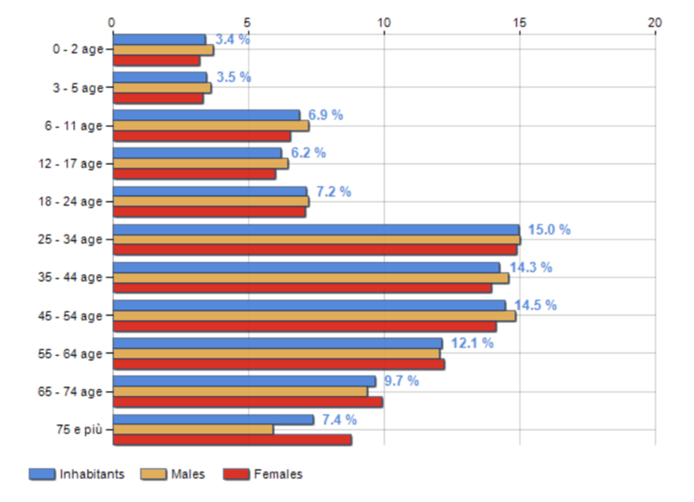
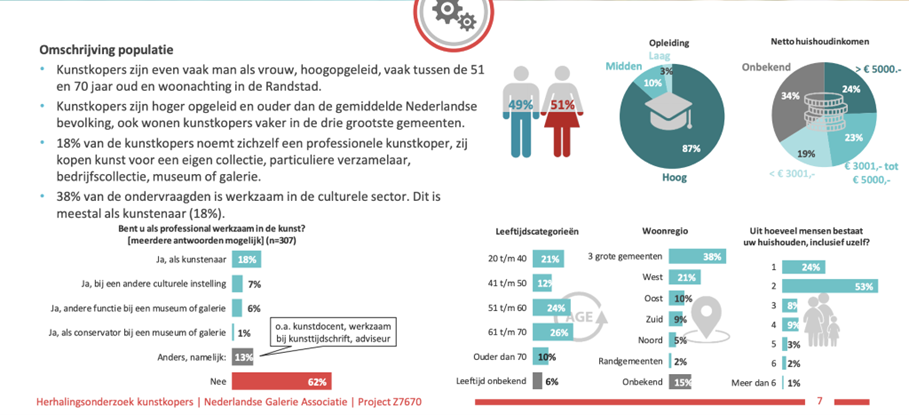
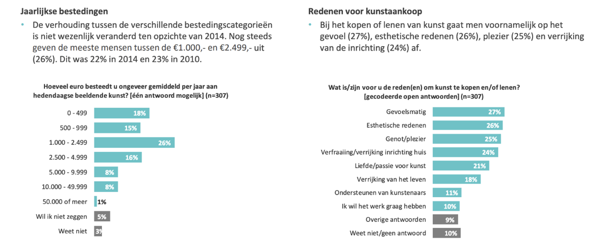

```{r setup, include=FALSE}
library(flexdashboard)
library(RSQLite)
library(dplyr)
library(DBI)
library(lubridate)
library(tidyverse)
library(scales)
library(maps)
library(readxl)
library(DT)
library(knitr)
library(reshape2)

con <- DBI::dbConnect(RSQLite::SQLite(), "LAN.db")
knitr::opts_chunk$set(connection = "con", echo = FALSE, warning=FALSE)
```

User map {data-icon="fa-users"}
===================================== 

Column {data-width=500}
-----------------------------------------------------------------------

### User and user's expense by country
``` {sql, connection = con, output.var = 'usertest'}
SELECT b.country, a.price bybid, d.price byorder
FROM (user b  join  bid a on a.userID = b.ID
left join art_order c on b.ID = c.userID)
left join art d on c.artID = d.ID

```

```{r message=FALSE, warning=FALSE}
####create data set
#calculate
user <- usertest %>% 
  mutate(bybid = replace_na(bybid,0), 
         byorder = replace_na(byorder,0),
         expense = as.double(bybid) + as.double(byorder),
         ) %>%
  group_by(Country) %>%
  summarize(expense = sum(expense), NrOfUser=n() ) 
#delete typo
usercountry <- user %>% 
  mutate(Country = sub( "\t", "", user$Country) ) %>% 
  mutate(Country = gsub( "\t", "", user$Country) ) 
#read dimension
longlat <- read_csv("world_country.csv", quote = ",")
region <- read_excel("countryregion.xlsx")
#create data
userrange <- longlat %>% 
  inner_join(region, by = c("country"="Country")) %>%
  select(country,latitude,longitude,Region) %>%
  replace_na(list(country = "Antarctica", Region = "Antarctica")) %>%
  inner_join(usercountry, by = c("country"="Country")) %>%
  group_by(Region)


####plot 
world <- map_data("world")
ggplot() +
  geom_map(
    data = world, map = world,
    aes(long, lat, map_id = region),
    color = "white", fill = "lightgray", size = 0.1
  ) +
  geom_point(
    data = userrange,
    aes(longitude, latitude, size = as.factor(NrOfUser), color = expense)) +
    theme_void()+
    labs(x = NULL, y = NULL, color = "Expense on art", size = "Number of users") +
  ggtitle("Number of user and user's expense on art by country")
  
```

Sales {data-navmenu="Art"}
=====================================

Column {data-width=200}
--------------------------------------
``` {sql, connection = con, output.var = 'biddingsold'}
SELECT ArtID, a.biddingtime BidTime, startdate, enddate, a.price BidPrice, c.Category, c.type
FROM bid a inner join art_bidding b on a.ArtBiddingID = b.ID inner join art c on b.ArtID = c.ID
GROUP BY b.ArtID
having BidPrice = max(BidPrice)
```

``` {sql, connection = con, output.var = 'artorder'}
SELECT ArtID, a.UserID, category, Type, quantity, price, date orderdate
FROM art_order a inner join art b on a.ArtID = b.ID
```

```{r message=FALSE, warning=FALSE, include=FALSE}
euro <- dollar_format(prefix="\u20ac",suffix = "")

bidsale <- biddingsold %>% 
  select(ArtID, Category,BidTime, BidPrice, Type) %>%
  group_by(Category, Type) %>%
  summarise(BidTotalSale = n(),BidRevenue = sum(as.integer(BidPrice)))

ordsale <- artorder %>% 
  select(Category,Quantity,Price,Type,orderdate) %>%
  group_by(Category, Type) %>%
  mutate(Revenue = as.integer(Price)*as.integer(Quantity) ) %>%
  summarise(OrdTotalSale = sum(as.integer(Quantity)), OrdRevenue = sum(Revenue))

sales <- bidsale %>% 
  inner_join(ordsale) %>%
  group_by(Category, Type) %>%
  summarise(TotalSale = BidTotalSale + OrdTotalSale, TotalRevenue = BidRevenue + OrdRevenue) %>%
  rbind(c(Category = "Non-objective",Type= "Mix of styles")) %>%
  rbind(c(Category = "Representational",Type= "Marble")) %>%
  rbind(c(Category = "Sculpture",Type= "Oil painting")) %>%
  rbind(c(Category = "Sculpture",Type= "Water painting")) %>%
  mutate(TotalSale = replace_na(TotalSale,0), TotalRevenue = replace_na(TotalRevenue,0))
```

### Total number of art sold

```{r}
totalsale <- bidsale %>% 
  inner_join(ordsale) 
valueBox(value = (sum(totalsale$BidTotalSale)+sum(totalsale$OrdTotalSale)),icon = "fa-line-chart",caption = "pieces sold", color = "#FFD9A7")
```


### Pieces sold through order
```{r}
#valueBox(value = sum(totalsale$OrdTotalSale),icon = "fa-shopping-cart",caption = "pieces sold through order", color = "#CCEBC6")
gauge(sum(totalsale$OrdTotalSale), 
      min = 0, 
      max = (sum(totalsale$BidTotalSale)+sum(totalsale$OrdTotalSale)),
      gaugeSectors(colors = "#CCEBC6"))
```

### Total art sold by bidding

```{r}
#valueBox(value = sum(totalsale$BidTotalSale),icon = "fa-gavel",caption = "pieces sold through bidding", color = "#B4CDE3")
gauge(sum(totalsale$BidTotalSale), 
      min = 0, 
      max = (sum(totalsale$BidTotalSale)+sum(totalsale$OrdTotalSale)),
      gaugeSectors(colors = "#B4CDE3"))
```


Column{data-width=400}
-------------------------------------
### Sale comparison between order and bidding
```{r message=FALSE, warning=FALSE}
bidsaleplot <- bidsale %>% 
  inner_join(ordsale) %>%
  group_by(Category) %>%
  summarise(Bidding = sum(BidTotalSale), Order = sum(OrdTotalSale)) %>%
  gather("SaleType","Nrofsale", 2:3) %>%
  group_by(Category) %>%
  mutate(percent=Nrofsale/sum(Nrofsale), labels = paste0(round(percent*100,1), "%", "(", Nrofsale, ") "))
#plot
  ggplot(bidsaleplot,aes(x="", y=percent, fill=SaleType)) +
  geom_bar(width = 1, stat = "identity", position="fill") + 
  coord_polar("y", start=0)  + 
  facet_wrap(~Category) +
  theme_void() + 
 #theme(legend.position="none") +
  #geom_text(aes(label = scales::percent(round(percent,3))), color="white", position=position_fill(0.5))+
  geom_text(aes(label = labels), color="white", position=position_fill(0.5)) +
  ggtitle("Sale comparison between order and bidding (in percent)") +
  scale_fill_brewer(palette="Pastel1")
```
 
### Sale comparison between order and bidding in Euros
```{r message=FALSE, warning=FALSE}
bidsaleplotvalue <- bidsale %>% 
  inner_join(ordsale) %>%
  group_by(Category)

df1 <- bidsaleplotvalue %>% 
  select(BidRevenue, OrdRevenue, Category)

df2 <- melt(df1, id.vars='Category')

ggplot(df2, aes(x=Category, y=value, fill=variable)) +
    geom_bar(stat='identity', position='dodge')
```

Column{data-width=400}
-------------------------------------
### Number of art sold by type by month

```{r }
a1 <- biddingsold %>%
  group_by(month=month(BidTime)) %>%
  summarise(Bidding = n())
b1 <- artorder %>%
  group_by(month=month(orderdate)) %>%
  summarise(Order = n())

a1 %>% 
  full_join(b1, by= "month") %>%
  mutate(Bidding = coalesce(Bidding, 0))%>%
  mutate(Total = Bidding+Order) %>%
  gather(key = "SaleType", value = "Number of art sold", -month) %>%
  ggplot(aes(x=month, y=`Number of art sold`,fill=SaleType)) + 
  geom_col(position = 'dodge') +
  scale_fill_brewer(palette = "Pastel1") +
  geom_text(aes(label=`Number of art sold`),position=position_dodge(width=0.9), vjust=0.5,  color ="darkgrey") + xlab("Month") +
  ggtitle("Number of art sold by type by month") 
  
```

Revenue {data-navmenu="Art"}
=====================================

Column {data-width=350}
-------------------------------------
```{r include=FALSE }
a<-biddingsold %>%
  mutate(BidTime=as.Date(BidTime)) %>%
  group_by(month=month(BidTime)) %>%
  summarise(BidRevenue = sum(as.integer(BidPrice))) 
b<-artorder %>%
  mutate(orderdate=as.Date(orderdate)) %>%
  group_by(month=month(orderdate))%>%
  summarise(OrdRevenue = sum(as.integer(Price)))
```
### Total revenue from selling art in 2020
```{r}
totalrev <- a %>% 
  full_join(b, by = "month") %>%
  mutate(BidRevenue = coalesce(BidRevenue, 0)) %>%
  group_by(month) %>%
  mutate(TotalRevenue = BidRevenue+OrdRevenue) 

valueBox(value = euro(sum(totalrev$TotalRevenue)),icon = "fa-line-chart",caption = "total revenue from selling art", color = "#FBB4AE")
```

### Art price range
``` {sql, connection = con, output.var = 'art'}
SELECT *
FROM art;
```

```{r message=FALSE, warning=FALSE, echo=FALSE}
art %>% 
  select(Price, Quantity) %>% 
  mutate(Price = as.integer(Price),
         `Spending Amount`=case_when(
    Price <1000 ~ "<1000€",
    Price>1000 & Price <5000 ~ "1000-4999€",
    Price>5000 & Price <10000 ~ "5000-9999€",
    Price>10000 & Price <15000 ~ "10000-14999€",
    Price>15000 & Price <18000 ~ "15000-17999€",
    TRUE ~">18000€"
  )) %>% 
  group_by(`Spending Amount`) %>%
  summarise(Quantity = sum(as.integer(Quantity))) %>% 
  mutate(Percent = Quantity/sum(Quantity), 
         `Spending Amount`=fct_relevel(`Spending Amount`,"<1000€","1000-4999€","5000-9999€","10000-14999€","15000-17999€",">18000€" )) %>% 
  ggplot(aes(x="", y=Percent, fill=`Spending Amount`)) +
  geom_bar(width = 1, stat = "identity", position="fill") + 
  coord_polar("y", start=0)  + 
  theme_void() + 
  geom_text(aes(label = scales::percent(round(Percent,3))), color="darkgrey", position=position_fill(0.5))+
  scale_fill_brewer(palette="Pastel1") 
```


Column {data-width=400}
-------------------------------------
### Revenue from selling art by month

```{r }
a %>% 
  full_join(b, by = "month") %>%
  mutate(BidRevenue = coalesce(BidRevenue, 0)) %>%
  group_by(month) %>%
  mutate(TotalRevenue = BidRevenue+OrdRevenue) %>%
  gather(key = "SaleType", value = "Revenue", -month) %>%
  ggplot( aes(x = month, y = Revenue)) + 
  geom_line(aes(color = SaleType, linetype = SaleType))  + 
  scale_y_continuous(labels = dollar_format(suffix = "€", prefix = "")) +
  ggtitle("Revenue from selling art in 2020") +
  xlab("Month") + ylab("Amount")
```

Column {data-width=350}
-------------------------------------

### Income from selling art by category by type
```{r message=FALSE, warning=FALSE}
sales %>%
  group_by(Category,Type) %>%
  ggplot(aes(x=Category, y=TotalRevenue, fill=Type) ) + geom_col(position = 'dodge')+ 
  ggtitle("Total amount from selling art by category by type") + 
  ylab("Amount") +
  scale_fill_brewer(palette = "Pastel1") +
  scale_y_continuous(labels = dollar_format(suffix = "€", prefix = ""))  +
  geom_text(aes(label=ifelse(TotalRevenue==0, TotalRevenue, " ")),vjust=-0.8,position=position_dodge(width=0.9))
```

### Total Revenue from selling art by category 
```{r message=FALSE, warning=FALSE, echo=FALSE}
totalsales <- bidsale %>% 
  inner_join(ordsale) %>%
  group_by(Category) #%>%
  
sales %>%
  group_by(Category) %>% 
  summarise(TotalRevenue = sum(TotalRevenue)) %>%
  select(Category,TotalRevenue) %>%
  ggplot(aes(x=Category, y=TotalRevenue) ) + 
  ggtitle("Total amount from selling art by category") + 
  ylab("Amount") +
  geom_col(fill="#BACFE2") +
  scale_y_continuous(labels = dollar_format(suffix = "€", prefix = "")) +             
  geom_text(aes(label=TotalRevenue),vjust=1.2,  color ="white")
```

Tickets{data-icon="fa-ticket"}
=====================================
Column {data-width=400}
-------------------------------------

### Total income from selling ticket in 2020
``` {sql, connection = con, output.var = 'ticketsold'}
SELECT date,a.ID, agecategory,description, duration, b.price, a.quantity
FROM (ticket_order a join ticket b on a.ticketid = b.id) join ticket_type c on b.tickettypeid=c.id
;
```

```{r}
ticket <- ticketsold %>% 
  mutate(Revenue = as.double(Price)*as.integer(Quantity)) %>%
  group_by(Description, Duration) %>%
  summarise(Totalsale = sum(as.integer(Quantity)), TotalRevenue = sum(Revenue))

valueBox(value = euro(sum(ticket$TotalRevenue)),icon = "fa-line-chart",caption = "total amount gained from selling ticket", color = "#FFD9A7")
```

### Total Number of ticket sold
```{r}
valueBox(value = sum(ticket$Totalsale),icon = "fa-ticket",caption = "tickets sold", color = "#CCEBC6")
```

### Ticket sold by type by duration

```{r message=FALSE, warning=FALSE, echo=FALSE}
ticketsold %>% 
  mutate(Revenue = as.double(Price)*as.integer(Quantity)) %>%
  group_by(Description, Duration) %>%
  summarise(Totalsale = sum(as.integer(Quantity)), TotalRevenue = sum(Revenue)) %>%
  ggplot(aes(x=Description, y=Totalsale, fill=Duration)) + geom_col(position = 'dodge') + 
  scale_fill_brewer(palette = "Pastel1") +
  geom_text(aes(label=Totalsale), position=position_dodge(width=0.9), color ="darkgrey") +    ggtitle("Number of ticket sold by ticket type by duration type") + 
  ylab("Number of ticket sold")
  
```

Column {data-width=600}
-------------------------------------

### Income from selling ticket by type by duration
```{r message=FALSE, warning=FALSE}
ticketsold %>% 
  mutate(Revenue = as.integer(Price)*as.integer(Quantity)) %>%
  group_by(Description, Duration) %>%
  summarise(TotalRevenue = sum(Revenue)) %>%
  ggplot(aes(Description, TotalRevenue,fill = Duration)) + geom_col(position = 'dodge') + 
  scale_y_continuous(labels = dollar_format(suffix = "€", prefix = "")) +
   scale_fill_brewer(palette = "Pastel1") +
  geom_text(aes(label=TotalRevenue), position=position_dodge(width=0.9), color ="darkgrey") + 
  ggtitle("Total amount from selling ticket") + 
  ylab("Amount")
```

### Income from selling ticket
```{r warning=FALSE}
ticketsold %>%
  mutate(Revenue = as.integer(Price)*as.integer(Quantity)) %>%
  group_by(Description) %>%
  summarise(TotalRevenue = sum(Revenue))%>%
  ggplot(aes(x=Description, y=TotalRevenue) ) + 
  ggtitle("Total amount from selling ticket ") + 
  ylab("Amount") +
  geom_col(fill="#BACFE2") +
  scale_y_continuous(labels = dollar_format(suffix = "€", prefix = "")) +             
  geom_text(aes(label=TotalRevenue),width=0.9,  color ="darkgrey")
```

Artists{data-icon="fa-paint-brush"}
=====================================

Column {data-width=250}
-------------------------------------

### Total number of artist
``` {sql, connection = con, output.var = 'artist'}
SELECT a.*, b.quantity, b.price
FROM artist a inner join art b on a.ID=b.ArtistID;
```

```{r}
artistsale <- artist %>% 
  group_by(Name) %>%
  mutate(sold = as.integer(Quantity)*as.integer(Price)) %>%
  summarise(Quantity = sum(as.integer(Quantity)),`Total sale` = sum(sold)) %>%
  arrange(desc(`Total sale`))
nrartist = artistsale %>% nrow()
valueBox(value = nrartist,icon = "fa-users",caption = "artists in total", color = "#FFD9A7")
```

### Average revenue one artist bring
```{r}
valueBox(value = euro(round(sum(artistsale$`Total sale`)/nrow(artistsale),0)),icon = "fa-money",caption = "amount one artist gained", color = "#B4CDE3")
```

### Average number of piece one artist sold
```{r}
valueBox(value = round(sum(artistsale$Quantity)/nrow(artistsale),1),icon = "fa-picture-o",caption = "average number of pieces sold by one artist", color = "#FBB4AE")
```

Column {data-width=450}
-------------------------------------
### Percentage of sales gained by artists
```{r}
artist %>% 
  group_by(Name) %>%
  summarise(`Total revenue` = sum(as.integer(Quantity)*as.integer(Price))) %>%
  mutate(RevPercent = `Total revenue`/sum(`Total revenue`)) %>%
  filter(RevPercent > 0.069) %>% 
  #mutate(Name=if_else(RevPercent < 0.069, "Others", Name)) %>%
  group_by(Name) %>%
  summarise(RevPercent=sum(RevPercent))%>%
  ggplot(aes(x="", y=RevPercent, fill=Name)) +
  geom_bar(width = 1, stat = "identity", position="fill") + 
  coord_polar("y", start=0)  + 
  theme_void() + 
  geom_text(aes(label = scales::percent(round(RevPercent,2))), color="darkgrey", position=position_fill(0.5))+
  ggtitle("Percentage of sales gained by artists") +
  scale_fill_brewer(palette="Pastel1") 
```

### Percentage of pieces sold by artists
```{r}
artist %>% 
  group_by(Name) %>%
  summarise(`Total Quantity` =sum(as.integer(Quantity))) %>%
  mutate(QuanPercent = `Total Quantity`/sum(`Total Quantity`)) %>%
  filter(QuanPercent > 0.054) %>% 
  #mutate(Name=if_else(QuanPercent < 0.054, "Others", Name)) %>%
  group_by(Name) %>%
  summarise(QuanPercent=sum(QuanPercent))%>%
  ggplot(aes(x="", y=QuanPercent, fill=Name)) +
  geom_bar(width = 1, stat = "identity", position="fill") + 
  coord_polar("y", start=0)  + 
  theme_void() + 
  geom_text(aes(label = scales::percent(round(QuanPercent,3))), color="darkgrey", position=position_fill(0.5))+
  ggtitle("Percentage of pieces sold by top artists") +
  scale_fill_brewer(palette="Pastel1") 
```

Column {data-width=300}
-------------------------------------
### Artists 
```{r}
artistsale %>% select(-Quantity)  %>% datatable()
```


Events{data-icon="fa-newspaper-o"}
=====================================
Column {data-width=550}
-------------------------------------
``` {sql, connection = con, output.var = 'event'}
SELECT Name, StartDate, EndDate, Location
FROM event
```
### Total number of event
```{r}
nrevent = event %>% nrow()
valueBox(value = nrevent,icon = "fa-calendar-o",caption = "events", color = "#B4CDE3")
```

### Average duration of an event
```{r}
avgduration=event %>%
  mutate(Duration = as.Date(EndDate) - as.Date(StartDate)) %>%
  summarise(AvgDuration = round((sum(Duration)/n())*10,1))
valueBox(value = avgduration,icon = "fa-clock-o",caption = "days in average", color = "#CCEBC6")
```

### Event timeline

```{r}
event2 <- event %>%
  mutate(StartDate = as.Date(StartDate),EndDate = as.Date(EndDate)) 
##determine position
positions <- c(0.5, -0.5, 1.0, -1.0, 1.3, -1.3, 1.6, -1.6, 1.8, -1.8,2,-2) 
directions <- c(1, -1) 
line_pos <- data.frame(
    "StartDate"=unique(event2$StartDate),
    "position"=rep(positions, length.out=length(unique(event2$StartDate))),
    "direction"=rep(directions, length.out=length(unique(event2$StartDate))))
event2 <- merge(x=event2, y=line_pos, by= "StartDate", all = TRUE) 
##month & year format
month_date_range <- seq(min(event2$StartDate) - months(2), max(event2$StartDate) + months(2), by='month') 
month_format <- format(month_date_range, '%b') 
month_df <- data.frame(month_date_range, month_format)

year_date_range <- 
  seq(min(event2$StartDate) - months(1), max(event2$StartDate) + months(1), by='year') %>%
  as.Date(
    intersect(
        ceiling_date(year_date_range, unit="year"),
        floor_date(year_date_range, unit="year")),  
        origin = "1970-01-01") 
year_format <- format(year_date_range, '%Y') 
year_df <- data.frame(year_date_range, year_format)
##text position
event2$text_position<- (abs(event2$position)  + 0.1 ) * event2$direction 

####plot
event2 %>%
  ggplot(aes(x=StartDate, y= position)) + 
  labs(col="Name") +
  theme_classic() +
  geom_hline(yintercept=0, color = "black", size=0.2)+
  geom_segment(aes(y=position,yend=0,xend=StartDate), color='black', size=0.2)+
  geom_point(aes(y=position), size=2) +
  theme(axis.line.y=element_blank(),
        axis.text.y=element_blank(),
        axis.title.x=element_blank(),
        axis.title.y=element_blank(),
        axis.ticks.y=element_blank(),
        axis.text.x =element_blank(),
        axis.ticks.x =element_blank(),
        axis.line.x =element_blank(),
        legend.position = "bottom" ) +
  geom_text(data=month_df, aes(x=month_date_range,y=-0.15,label=month_format),size=3.5,vjust=0.5, color='black', angle=90) +
  geom_text(data=year_df, aes(x=year_date_range,y=-0.3,label=year_format, fontface="bold"),size=3.5, color='black') +
  geom_text(aes(y=text_position,label=Name),size=3.5, vjust=0.6)

```


Column {data-width=450}
-------------------------------------

### Event list
```{r}
event %>% datatable()
```

Partners{data-icon="fa-handshake-o"}
=====================================
Column {data-width=550}
-----------------------------------------------------------------------

### List of partners
``` {sql, connection = con, output.var = 'partner'}
SELECT *
FROM partner
```

```{r}
partner %>% 
  select(Name, Category, Address) %>% 
  datatable()
```

Facts and figures {data-icon="fa-atlas"}
=====================================

Column {data-width=200}
-----------------------------------------------------------------------

### Haarlems age demographic
```{r}
 
```

### Haarlems income demographic
Average Monthly Net Salary in Haarlem is 2'692.57, around 200€ higher than Rotterdam (2,356.79 €) and around 200€ lower than Amsterdam (2,885.07 €). Also, with housing price, Price per Square Meter to Buy Apartment in City Centre is 6,016.12 €, as compared to 7,609.01 € in Amsterdam and 3,930.76 € in Rotterdam. The inhabitants of Haarlem are considered wealthy. 

### Demography of art buyers
```{r}
 
```

Column{data-width=300}
-------------------------------------

### Art spenings in the Netherlands
```{r}
 
```


### Art spenings in the Netherlands
A gallery spends considerably more money on contemporary visual art than online. In a gallery most people give between € 1,000 and € 2,499 off (27%), while most people online mainly buy art in the lowest spending category € 0 € 499 (47%).

Still most people spend between € 1,000 and € 2,499(26%). This was 22% in 2014 and 23% in 2010.